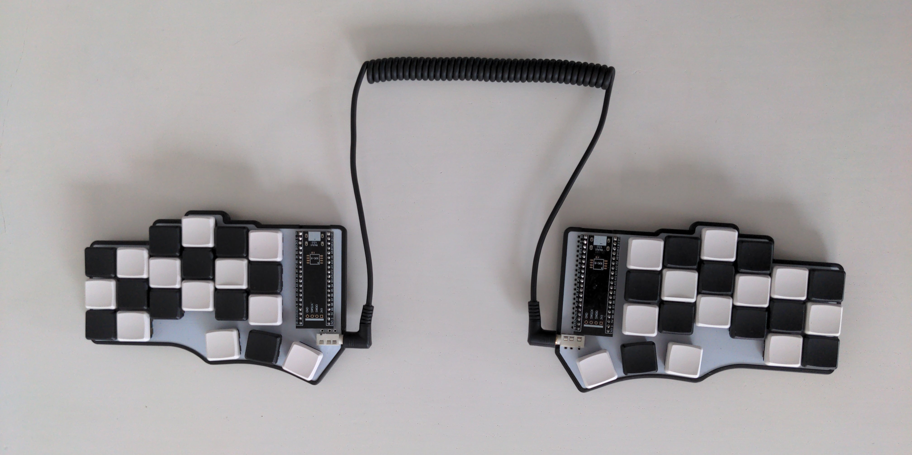
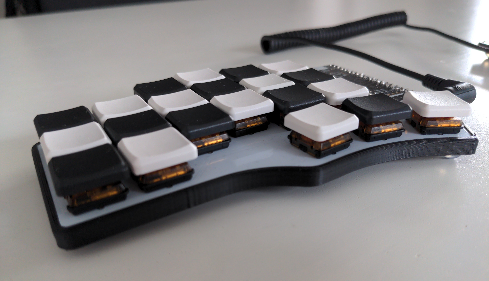

# Cantor (rev1)

This keyboard was the second self-built QMK keyboard.

## Compiling & flashing

0. `export $QMK_CUSTOM_KEYMAPS=/path/to/dir`
1. `ln -s $QMK_CUSTOM_KEYMAPS/cantor $QMK_HOME/keyboards/cantor/keymaps/qysp`
2. `qmk compile -kb cantor -km qysp`
3. `qmk flash -kb cantor -km qysp`
