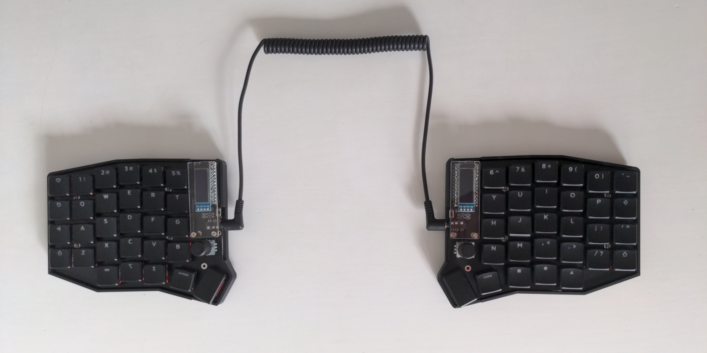
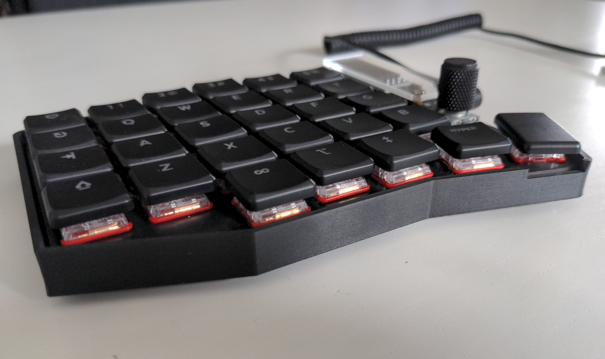

# Sofle Choc

This keyboard was the first self-built QMK keyboard.

## Compiling & flashing

Currently not possible using the official QMK repo.
Use brianlow's repository (branch `choc2`) instead.

**Note:** The currently used keymap is actually the `keymap.json` using Via.
